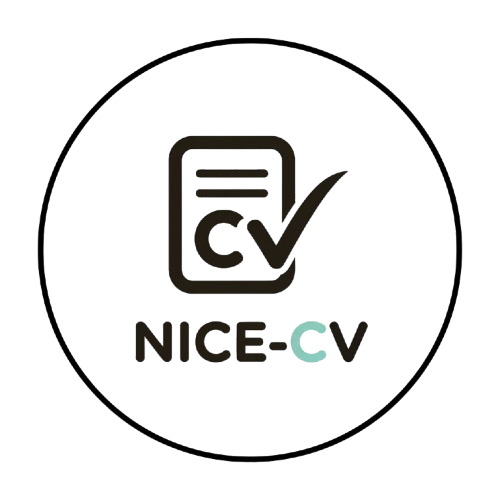

<div align="center">
  
  <h1>NICE-CV</h1>
  <p><strong>Créez votre CV professionnel en quelques minutes.</strong></p>
  
  
  
  
</div>

---

## 📋 À propos

**NICE-CV** est une plateforme SaaS intuitive qui permet aux chercheurs d'emploi et aux professionnels de concevoir des CV esthétiques et percutants sans effort. Grâce à nos templates modernes et notre éditeur en temps réel, mettez toutes les chances de votre côté.

## ✨ Fonctionnalités Clés

### 👤 Espace Utilisateur
*   **Éditeur Temps Réel** : Visualisez vos modifications instantanément.
*   **Templates Premium** : Accès à une bibliothèque de modèles (Moderne, Épuré, Créatif).
*   **Export PDF** : Téléchargement haute qualité prêt pour l'impression.
*   **Gestion Multi-CV** : Créez et gérez plusieurs versions de votre CV.
*   **Paiement Mobile** : Abonnement Premium simple via Orange Money, Wave et MTN (Côte d'Ivoire).

### 🛡️ Espace Administrateur
*   **Dashboard Complet** : Vue d'ensemble des utilisateurs et des statistiques.
*   **Suivi des Revenus** : Monitoring des abonnements et paiements.
*   **Gestion des Utilisateurs** : Contrôle total sur la base utilisateurs.

## 🛠 Technologies Utilisées

Ce projet est construit avec une stack moderne et performante :

<div align="center">
  
  
  
  
  
  
</div>

*   **Frontend & Backend** : [Next.js 14](https://nextjs.org/) (App Router, Server Actions)
*   **Langage** : [TypeScript](https://www.typescriptlang.org/)
*   **Base de Données** : MongoDB & Prisma ORM
*   **Design** : Tailwind CSS & Lucide React
*   **Authentification** : NextAuth.js
*   **Déploiement** : Vercel

## 🚀 Installation & Démarrage

Suivez ces étapes pour lancer le projet en local :

### 1. Prérequis
*   Node.js 18+
*   MongoDB (Local ou Atlas)

### 2. Installation

```bash
# Cloner le dépôt
git clone https://github.com/votre-repo/nice-cv.git

# Aller dans le dossier
cd nice-cv

# Installer les dépendances
npm install
```

### 3. Configuration

Créez un fichier `.env` à la racine du projet et configurez vos clés :

```env
# Connexion Base de données
DATABASE_URL="mongodb+srv://..."

# Authentification
NEXTAUTH_URL="http://localhost:3000"
NEXTAUTH_SECRET="votre_secret_securise"

# Google Auth (Optionnel)
GOOGLE_CLIENT_ID="..."
GOOGLE_CLIENT_SECRET="..."
NEXT_PUBLIC_GOOGLE_CLIENT_ID="..."

# Configuration Paiement
GENIUS_API_KEY="..."
GENIUS_API_SECRET="..."
GENIUS_WEBHOOK_SECRET="..."
```

### 4. Lancement

```bash
# Générer le client Prisma
npx prisma generate

# Lancer le serveur de développement
npm run dev
```

Rendez-vous sur [http://localhost:3000](http://localhost:3000) !

## 👤 Auteur

Conçu et développé avec ❤️ par **NICE-DEV**.
